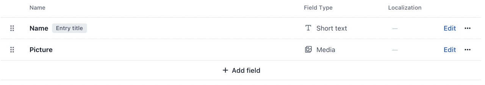
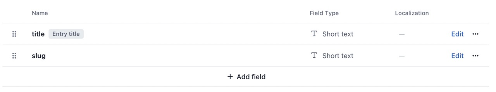
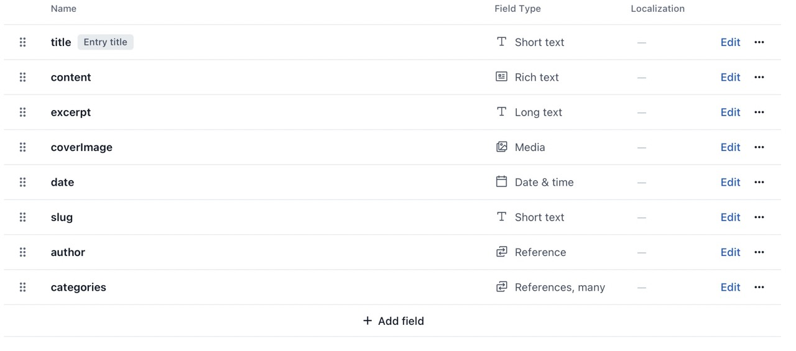

# Fiap Blog

This repository is for study purposes only.
It was a study based on an MBA Class for Front-end Development.

[FIAP - Software Engineering MBA](https://www.fiap.com.br/mba/mba-em-engenharia-de-software/)

---

## React + TypeScript + Vite

The project was started using a simple template from React + Vite + TypeScript that provides a minimal setup to get React working in Vite with HMR and some ESLint rules.

Besides, there were some more added to the tech stack:

- [SWR](https://swr.vercel.app/): Next's SWR (Stale while revalidate) for caching
- [GraphQL](https://graphql.org/graphql-js/) to work with Contentful GraphQL API
- [shadcn/ui](https://ui.shadcn.com/) and [Tailwind](https://tailwindcss.com/) for styling
- [Vitest](https://vitest.dev/) and [React testing library](https://testing-library.com/docs/react-testing-library/intro/) for testing

Feel free to use it as a boiler plate for a simple blog application using [Contentful](https://www.contentful.com).

---

## Running this project

You can clone this project an use:

`npm run dev` to run this project in development mode

`npm test` to execute the included tests

## Requirements

To create a project using this repository's files you need:

1. Env file with your Contentful keys.
2. Types on Contentful like the ones expected in this application.

### Env file

- VITE_API_KEY="Your Contentful API Key"
- VITE_BASE_URL="Your base URL with your Contentful space"

### Contentful Content models

**Author fields**

- Name: `Short text`
- Picture: `Media`

**Categories fields**

- title: `Short text`
- slug: `Short text`

**Post fields**

- title: `Short text`
- content: `Rich text`
- excerpt: `Long text`
- coverImage: `Media`
- date: `datetime`
- slug: `Short text`
- author: `reference` (Reference to Author)
- category: `references` (Many - References to categories)

